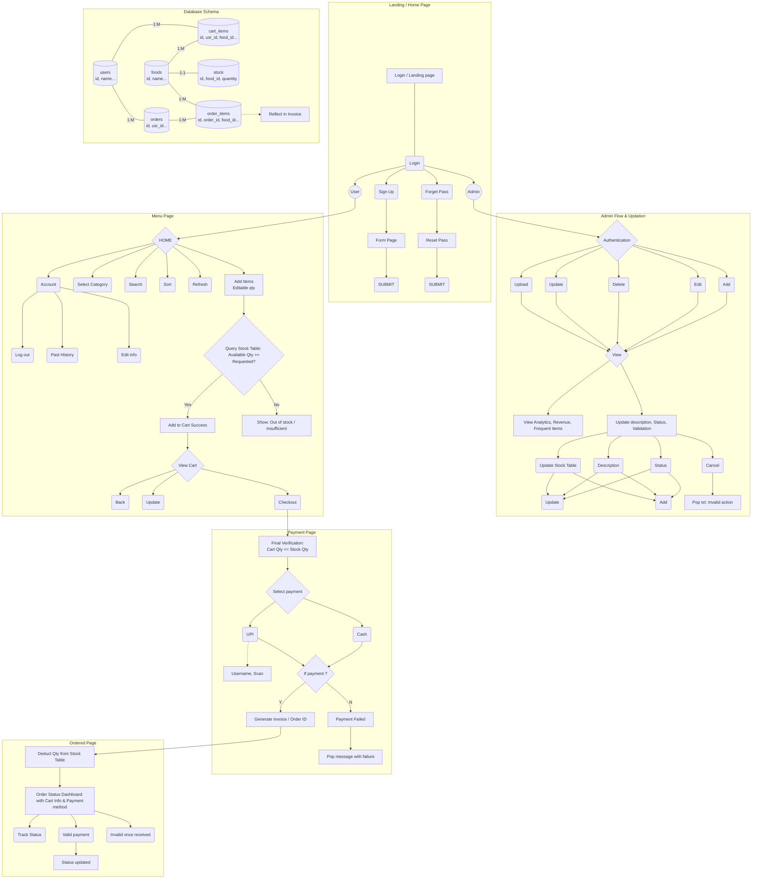

# KIIT Kafe - Campus 25 Ordering System

This document outlines the architecture, flow, and database schema for the KIIT Kafe application. The application is designed to handle user ordering, cart management, checkout, and admin management for a campus cafe.

---

## 🚀 Quick Setup Guide (XAMPP)

### Prerequisites
- **XAMPP** installed (download from [https://www.apachefriends.org](https://www.apachefriends.org))
- A web browser (Chrome, Firefox, Edge)

---

### Step 1: Install XAMPP
1. Download XAMPP from the official website.
2. Run the installer and install to the default location:
   - **Windows:** `C:\xampp`
3. Launch **XAMPP Control Panel**.

---

### Step 2: Start Services
1. In XAMPP Control Panel, click **Start** next to **Apache**.
2. Click **Start** next to **MySQL**.
3. Both modules should show green "Running" status.

---

### Step 3: Set Up the Project (Two Methods)

#### Method A: Copy to htdocs (Recommended for Beginners)

1. Navigate to your XAMPP installation folder: `C:\xampp\htdocs\`
2. Copy the entire `KIIT-KAFE` folder into `htdocs`.
   - Final path should be: `C:\xampp\htdocs\KIIT-KAFE\`
3. Open your browser and go to:
   ```
   http://localhost/KIIT-KAFE/
   ```

#### Method B: Run Directly from Current Location (Without Moving to htdocs)

If you don't want to move the folder to `htdocs`, you can run the project directly from its current location using PHP's built-in server or by configuring a virtual host.

1. Open **PowerShell** as Administrator.
2. Navigate to the project directory:
   ```cmd
    mklink /D C:\xampp\htdocs\KIIT-KAFE C:\Users\KIIT0001\KIIT-KAFE
   ```
3. Open your browser and go to:
   ```
    http://localhost/KIIT-KAFE
   ```


---

### Step 4: Create the Database

#### Option A: Using phpMyAdmin (Recommended)

1. Open your browser and go to:
   ```
   http://localhost/phpmyadmin
   ```
   (or `http://kiitkafe.local/phpmyadmin` if using virtual host)
2. Click the **Import** tab at the top.
3. Click **Choose File** and select `database.sql` from the project root.
4. Click **Go** at the bottom to import.
5. You should see `kiit_kaffe_db` database with all tables created.

#### Option B: Using MySQL Command Line

1. Open **Command Prompt**.
2. Navigate to MySQL bin directory:
   ```cmd
   cd C:\xampp\mysql\bin
   ```
3. Run the SQL script:
   ```cmd
   mysql -u root -p < "C:\Users\KIIT0001\KIIT-KAFE\database.sql"
   ```
   (Press Enter when prompted for password - default is empty, just press Enter again)

#### Option C: Using the Setup Script

1. Ensure Apache and MySQL are running in XAMPP.
2. Open your browser and navigate to:
   ```
   http://localhost/KIIT-KAFE/api/setup_db.php
   ```
   (Adjust URL based on your setup method)
3. The script will automatically create the `kiit_kaffe_db` database and all required tables.

---

### Step 5: Verify Installation

1. Open your browser and navigate to your project URL:
   - **htdocs method:** `http://localhost/KIIT-KAFE/`
   - **PHP server method:** `http://localhost:8000/`
   - **Virtual host method:** `http://kiitkafe.local/`
2. You should see the **Login Page**.
3. The database should contain:
   - **42 menu items** across 5 categories (Beverages, Coffee & Drinks, Snacks, Desserts, Meals)
   - Default admin account (check `database.sql` for credentials)

---

### Step 6: Default Login Credentials

**Admin Account:**
- **Email:** `admin@kiitkafe.com`
- **Password:** Check `database.sql` for the hashed password

**Test User Account:**
- You can create a new user account via the **Sign Up** page.

---

### Troubleshooting

| Issue | Solution |
|-------|----------|
| **Apache won't start (Port 80 busy)** | Stop Skype/IIS or change Apache port to 8080 in XAMPP config |
| **MySQL won't start (Port 3306 busy)** | Stop other MySQL services or change port in XAMPP MySQL config |
| **404 Not Found** | Ensure folder is in `htdocs` or virtual host is configured correctly |
| **Database connection error** | Check `api/db.php` for correct database credentials (default: root, no password) |
| **Blank page / White screen** | Enable error reporting in `php.ini` or check Apache error logs |
| **Permission denied** | Run XAMPP Control Panel as Administrator |

---

## 📋 Project Structure

```
KIIT-KAFE/
├── index.php              # Main entry point (Login/Home)
├── database.sql           # Database schema and sample data
├── README.md              # This file
├── .htaccess              # Apache configuration
├── api/                   # Backend API endpoints
│   ├── db.php             # Database connection
│   ├── create_order.php   # Order creation
│   ├── get_orders.php     # Fetch orders
│   ├── admin_menu_actions.php
│   └── ...
├── admin_files/           # Admin panel pages
│   └── dashboard.php
├── css/                   # Stylesheets
├── js/                    # JavaScript files
└── includes/              # Reusable PHP components
```

---

## 1. Overall Project Architecture & Application Flow

The application follows a structured flow based on user roles and actions:

**Overall Flow:**
`(Welcome page / Slide show) -> Home page -> Menu page -> Cart page -> Payment page -> Ordered page (Invoice) -> Welcome page`

### Authentication / Landing Page Flow

* **Login / Landing Page:** The entry point for all users.
* **Sign Up:** Directs to a "Form Page", followed by a "SUBMIT" action to create a new account.
* **Forget Pass:** Directs to a "Reset Pass" page, followed by a "SUBMIT" action.
* **Roles:** Upon login, the user journey splits into two distinct paths: **User** and **Admin**.

### User Flow (Menu & Cart)

* **HOME (Menu Page):** The main dashboard for users. It contains:
* Search, Select Category, Sort, and Refresh functionalities.


* **Account:** Branches into options for "Log out", "Past History", and "Edit info".
* **Item Addition Logic:**
* Checks the **`stock` table** to see if an item's quantity is greater than 0.
* If available -> "Add" button is active.
* If not available -> Marked as "Out of stock".


* **Cart Actions:**
* Users can Add Items (with editable quantity) -> View Cart -> Go Back.
* From the Cart, users can "Update" quantities or proceed to "Checkout".


### Checkout & Payment Flow (Payment Page)

* **Checkout:** Validates the order by checking if the requested quantities exist in the database (Quantity = Total).
* **Select Payment:** Offers two options:
* **Cash**
* **UPI:** Requires associated actions (Username, Scan).


* **Payment Validation:**
* **No (Failed):** Payment Failed -> Displays a pop-up message with the failure.
* **Yes (Success):** Generates an Invoice / Order ID -> Navigates to the Order Status Dashboard.


### Order Status Flow (Ordered Page)

* **Order Status Dashboard:** Displays Cart Information and Payment Method.
* Allows the user to "Track Status" of their order.
* **Status conditions:** A "Valid payment" leads to a "Status updated". Alternatively, it can be flagged as "Invalid once received".

### Admin Flow (Updation & Management)

* **Authentication:** Admins must successfully log in.
* **Actions:** Admins can Add, Edit, Delete, Update, and Upload items/data. These actions lead to a central "View" panel.
* **View Panel Branches:**
* **Analytics:** View Analytics, Revenue, and Frequent Items.
* **Management:** Update description, Status, and Validation.
* Further branches into updating Status, Description, and Quantity (now updating the `stock` table).
* Leads to final "Update" or "Add" actions.
* Contains an error handling path: Cancel -> Pop txt (Invalid action).


---

## 2. Complete Flowchart (Mermaid)



---

## 3. Detailed Explanation of the Menu Page

The Menu Page acts as the core interface for users after they log in. It is responsible for displaying available items, managing the user's cart, and navigating their account settings.

### Features & Functionality:

1. **Navigation & Filtering:**
* **Search:** Allows users to find specific food items by name.
* **Select Category:** Users can filter the menu items by their respective categories (e.g., Beverages, Snacks, Meals).
* **Sort:** Users can organize items (e.g., Price Low to High, A-Z).
* **Refresh:** Reloads the view to ensure the latest stock and items are displayed.


2. **Item Interaction & Cart Logic:**
* **Add Items:** Users can select items and adjust the quantity they want to order.
* **Availability Check Logic (via `stock` table):** * When a user attempts to add an item, the system queries the `stock` table linked to that specific food item.
* *If stock quantity > 0:* The "Add" button is active.
* *If stock quantity = 0:* The item is marked as "Out of stock" and cannot be added.


* **View Cart:** Users can open their cart to review their selected items. From here, they can update quantities, go back to the menu, or proceed to Checkout.


3. **Account Management:**
* Accessible via an "Account" menu or dropdown.
* **Past History:** Allows users to view their previous orders.
* **Edit Info:** Allows users to update their profile details (name, phone, password).
* **Log Out:** Ends the current user session.


---

## 4. Database Schema Details

To support the robust functionality of the application, particularly the Menu Page, inventory management, and the ordering process, the following relational database tables have been designed using MySQL/PHP PDO.

### 1. `users` Table

Stores all contextual data for authentication, profile management, and linking orders to specific individuals.

| Column | Type | Description |
| --- | --- | --- |
| `id` | INT (PK) | Unique identifier for each user. |
| `name` | VARCHAR(100) | Full name of the user. |
| `email` | VARCHAR(100) | Unique email address for login. |
| `pass` | VARCHAR(255) | Securely hashed password. |
| `phone` | VARCHAR(20) | Contact number. |
| `role` | ENUM | Defines if the user is a `user` or an `admin`. Defaults to `user`. |
| `created_at` | TIMESTAMP | When the account was created. |

### 2. `foods` Table

Stores all the primary menu data. The data here directly feeds into the Menu Page display and filtering. *(Note: Inventory tracking has been migrated to the `stock` table).*

| Column | Type | Description |
| --- | --- | --- |
| `id` | INT (PK) | Unique identifier for the food item. |
| `name` | VARCHAR(150) | The name of the item. |
| `description` | TEXT | Details about the food item. |
| `price` | DECIMAL(10,2) | Price of the item (handling currency accurately). |
| `category` | VARCHAR(50) | Used for the "Select Category" filtering feature. |
| `created_at` | TIMESTAMP | When the item was added to the menu. |

### 3. `stock` Table

Manages the inventory for all items in the cafe. This table is queried before allowing a user to add an item to their cart, ensuring accurate stock tracking.

| Column | Type | Description |
| --- | --- | --- |
| `id` | INT (PK) | Unique identifier for the stock record. |
| `food_id` | INT (FK) | Links the stock entry directly to the food item (`foods.id`). |
| `quantity` | INT | Current available quantity. Powers the "Out of Stock" logic. |
| `updated_at` | TIMESTAMP | Tracks the last time the inventory for this item was adjusted. |

### 4. `cart_items` Table

Acts as a temporary staging area when a user adds items from the Menu Page but hasn't checked out yet.

| Column | Type | Description |
| --- | --- | --- |
| `id` | INT (PK) | Unique identifier for the cart entry. |
| `usr_id` | INT (FK) | Links the cart item to the specific user (`users.id`). |
| `food_id` | INT (FK) | Links the cart item to the specific food (`foods.id`). |
| `quantity` | INT | The number of this specific item the user wants to buy. |
| `added_at` | TIMESTAMP | When the item was added to the cart. |

*Note: This table uses `ON DELETE CASCADE` for its foreign keys, meaning if a user or food item is deleted from the database, the associated cart entries are automatically cleaned up.*

### 5. `orders` Table

Created when a user successfully checks out. This stores the high-level summary of a transaction.

| Column | Type | Description |
| --- | --- | --- |
| `id` | INT (PK) | Unique identifier for the order (Order ID). |
| `usr_id` | INT (FK) | The user who placed the order. |
| `total_price` | DECIMAL(10,2) | The total calculated price of all items in the order. |
| `status` | ENUM | Current state of the order (`pending`, `completed`, `failed`, `invalid`). |
| `payment_method` | ENUM | How the user paid (`cash`, `upi`). |
| `created_at` | TIMESTAMP | When the order was finalized. |

### 6. `order_items` Table

Stores the specific individual items that belong to a finalized order. This is used to generate the Invoice and track exactly what was purchased.

| Column | Type | Description |
| --- | --- | --- |
| `id` | INT (PK) | Unique identifier for the order line item. |
| `order_id` | INT (FK) | Links back to the parent order (`orders.id`). |
| `food_id` | INT (FK) | Links to the specific food item purchased (`foods.id`). |
| `quantity` | INT | How many of this item were bought. |
| `price` | DECIMAL(10,2) | The price of the item *at the time of purchase* (in case the price in `foods` changes later). |

---

## 5. Database Setup (XAMPP)

Follow these steps to initialize the `kiit_kafe` database and its tables:

### Option A: Using phpMyAdmin (Recommended)
1. Open **XAMPP Control Panel** and start **Apache** and **MySQL**.
2. Open your browser and go to `http://localhost/phpmyadmin`.
3. Click the **Import** tab at the top.
4. Click **Choose File** and select `database.sql` from the project root.
5. Click **Import** (or **Go**) at the bottom.

### Option B: Using the Setup Script
1. Ensure **Apache** and **MySQL** are running in XAMPP.
2. Open your browser and navigate to: `http://localhost/KIIT-KAFE/api/setup_db.php`.
3. The script will automatically create the `kiit_kaffe_db` database and all required tables.

### Tables Created:
- **`users`**: Authentication and roles.
- **`foods`**: Menu items and pricing.
- **`stock`**: Real-time inventory tracking.
- **`cart_items`**: User shopping carts.
- **`orders`**: High-level transaction records.
- **`order_items`**: Detailed line items for each order.
